# Deploying Application to App Harbor

1. Go to appharbor.com and register

2. Click "CREATE NEW" and name it whatever you want your URL to be

3. Click 'Configure GitHub to deploy to AppHarbor'

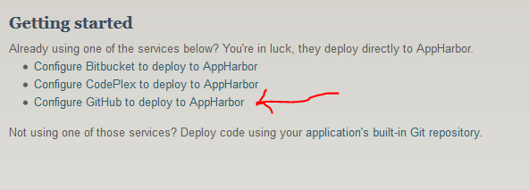

4. Choose your repository from the dropdown

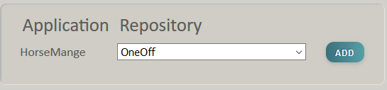

5. Wait for it to build. It may take awhile. It may fail. If it fails, click the logs and see if you can figure out what went wrong.

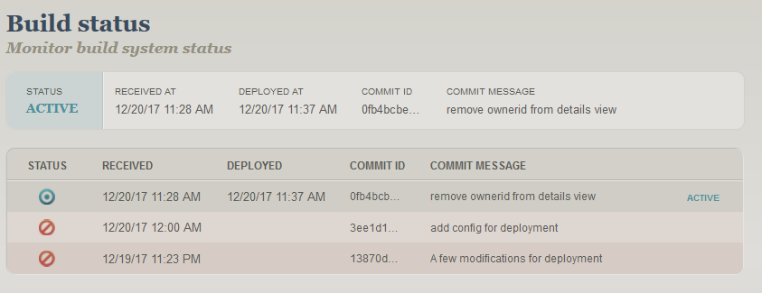

6. If it succeeds - you application is hooked up to GitHub, if you push changes to GitHub, AppHarbor will redeploy

7. Now to hook up the database.

8. Under 'installed add-ons' - click on 'add-on catalog'

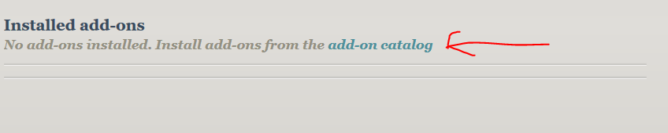

9. You'll be presented with a bunch of apps you can add on. You're looking for SQL Server - but, don't choose Dedicated SQL Server (it costs)

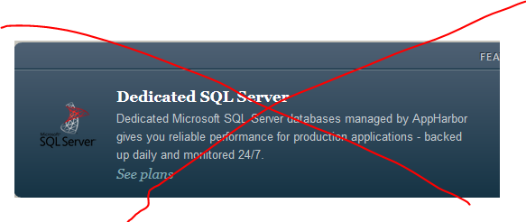

This is what you want:

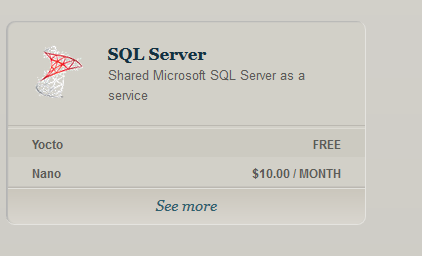

10. Click see more and then choose Yocto

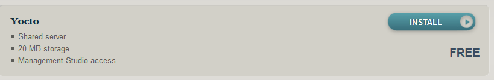

11. Now on your App's main page at AppHarbor, you should see SQL Server under 'Installed add-ons' Click on SQL Server

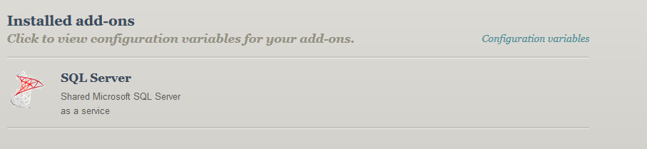

12. Next click on Go to SQL Server

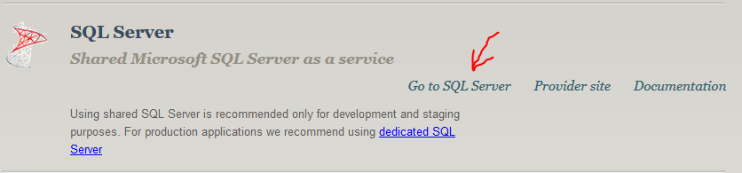

13. Click on 'Edit database configuration'

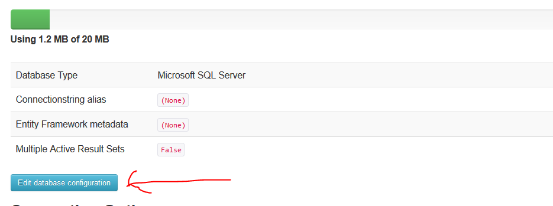

14. Change the alias to whatever your ConnectionString is in your application. Probably "DefaultConnection" unless you changed it. And then click 'Update'

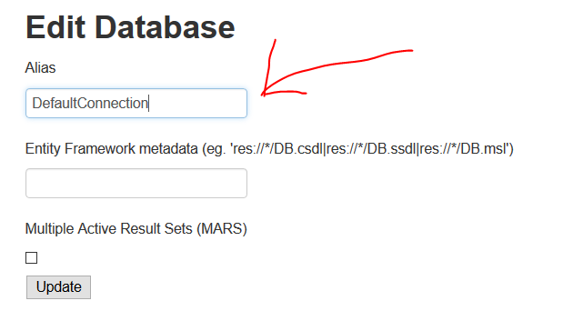

15. Your app should be ready to go!

